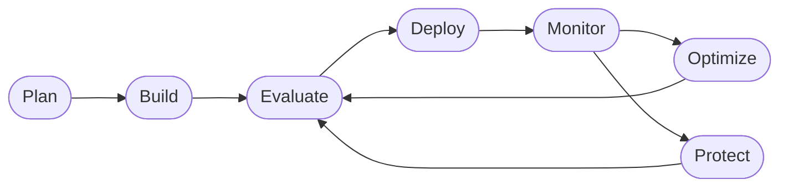

# Course Plan — Contoso Travel Concierge Workshop

> Canonical plan for the workshop. Edit this file when the course structure,
> pedagogy, or coach behavior changes — it is the reference used for future
> revisions and by contributors.

## Problem

Consolidate two prior workshops (`Azure-Samples/microsoft-foundry-e2e-agent-observability-workshop`
and `microsoft/Build26-LAB540`) into **one living course** that teaches the full
**Agent DevOps loop** on Microsoft Foundry: plan → build → evaluate → deploy →
monitor → optimize → protect.

The course uses one consistent scenario — **Contoso Travel Concierge** — with a
shared dataset across a **Prompt Agent** (no-code, portal) and a **Hosted Agent**
(containerized code). Learners complete a finite Core journey, then explore an
infinitely extensible library of deep-dive labs. A repo-scoped
**workshop-coach** GitHub Copilot agent supports self-guided learners with
just-in-time guidance and progress tracking — never doing the work for them.

## Three-phase course structure

1. **Fundamentals** — provision + deploy (everyone at the same starting line)
2. **Core Labs** — complete the Agent DevOps loop on the Prompt Agent; apply it
   to the Hosted Agent as a capstone (finite, beginner-completable)
3. **More Labs** — one-question-per-lab deep dives (infinitely extensible)

### Agent DevOps loop (anchor diagram)



Every lab highlights the node it teaches.

## Locked design decisions

| Decision | Choice |
|---|---|
| Agent name | **Contoso Travel Concierge** |
| Shared dataset | `data/{flights,hotels,car_rentals}.csv` — single source of truth |
| Implementations | Prompt Agent (portal, Core Labs) + Hosted Agent (`src/`, capstone + More Labs) |
| Reset mechanic | `src.original/` snapshot + `scripts/reset.sh` (visible, diff-friendly) |
| Provisioning | Both paths: `azd up` (self-guided) **and** Foundry portal walkthrough |
| Living resource | Evergreen `main` + pinned event branches |

## Pedagogy — one concept or one flow step per lab

Every lab file follows the same **problem-first, verify-at-the-end** template so
learners always know what they're solving and can prove they solved it.

### Lab template

Canonical template lives at `labs/_template/lab-template.md`. Structure:

1. **Header** — what you'll do (one sentence), time, prerequisites
2. **🎯 Goal** — single concept taught or single DevOps-loop step completed
3. **🧭 Where this fits** — small mermaid diagram anchoring the lab on the loop
4. **📋 Steps** — numbered atomic steps with inline "you should now see…" checkpoints
5. **✅ Verify** — an explicit, testable check (URL, CLI, expected output)
6. **🧠 Recap** — 2–4 bullets: what you learned, what changed
7. **➡️ Next** — link to the next lab

### Visual documentation guidelines

- **Mermaid** for every phase overview, loop location, and multi-step flow
- **Tables** for comparisons (paths, evaluators, metrics, models) — no prose lists
- **Screenshots** in `labs/<phase>/images/` with descriptive alt text, cropped
- **Callouts:** `> 🎯` goal · `> ✅` verify · `> 💡` tip · `> ⚠️` gotcha ·
  `> 🧭` where-you-are · `> 🧠` recap

## Workshop-Coach agent

A repo-scoped GitHub Copilot custom agent for self-guided learners. **Coaches**
learning; never completes tasks. Skills-based composition.

- File: `.github/agents/workshop-coach.agent.md`
- Skills: `.github/agents/skills/{progress-tracker,lab-guide,verify-check,bookmark,explore-suggest,resume}.md`
- Progress state (per-learner, outside repo): `~/.contoso-coach/progress.json`

### Behavior contract

- **Never** edits files, runs destructive commands, or completes lab steps
- **Always** resolves current phase and lab from progress state before responding
- **Answers with guidance and questions back** — points to the relevant lab
  section, evaluator, or docs link; does not paste solutions
- Engages exploratory tangents, **bookmarks** the current lab, and offers to resume
- Suggests 2–3 "you could also ask…" prompts on exploratory replies
- Politely refuses "do it for me" requests

### Skills

| Skill | Purpose |
|-------|---------|
| `progress-tracker` | Read/write `~/.contoso-coach/progress.json` |
| `lab-guide` | Load the current lab and produce next-step guidance without revealing full answers |
| `verify-check` | Walk the learner through the lab's `## ✅ Verify` block; ask what they see |
| `bookmark` | Save/restore learner position when detouring |
| `explore-suggest` | Offer tangential prompts anchored to current lab |
| `resume` | Restore the last bookmark and re-anchor the learner |

## Repository layout

```
/
├── README.md
├── LICENSE
├── AGENTS.md                       # General Copilot + Foundry skills guidance
├── .github/
│   ├── PLAN.md                     # THIS FILE
│   └── agents/
│       ├── workshop-coach.agent.md
│       └── skills/
│           ├── progress-tracker.md
│           ├── lab-guide.md
│           ├── verify-check.md
│           ├── bookmark.md
│           ├── explore-suggest.md
│           └── resume.md
├── data/                           # Shared CSVs — single source of truth
├── src/                            # Hosted agent working copy (learners edit)
├── src.original/                   # Pristine snapshot (read-only reference)
├── infra/                          # azd bicep/terraform
├── scripts/                        # reset.sh, provision-portal.md, seed-prompt-agent.sh
├── labs/
│   ├── _template/lab-template.md
│   ├── fundamentals/               # 00–06 labs
│   ├── core/                       # 00–05 labs (incl. capstone)
│   └── more/                       # Extensible deep dives
├── requirements.txt
└── .devcontainer/
```

## Reproducibility guarantees

- `data/` is the single source of truth for both agents
- `src.original/` is the pristine baseline for the Hosted Agent
- `scripts/reset.sh` restores `src/` from `src.original/` in one command
- Prompt Agent baseline instructions captured in
  `labs/fundamentals/04-create-prompt-agent.md` so learners can re-seed
- Coach progress file lives outside the repo → does not leak between learners

## Open questions

- Exact model list (agent model, evaluator model, embedding?) — decide during
  Fundamentals authoring
- Whether to ship `.devcontainer/` on day one or add later
- Whether to port Zava CSVs as-is (rebranded) or curate a smaller eval-friendly set
