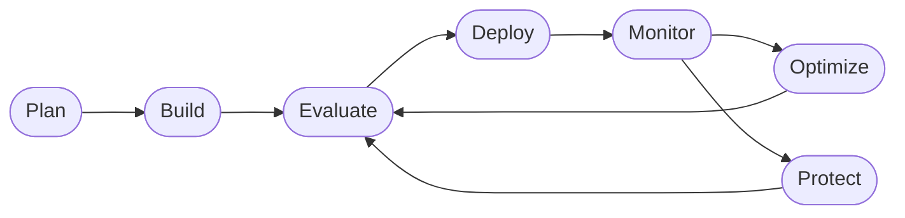

<div align="center">

# Build, Evaluate & Optimize AI Agents with Microsoft Foundry & GitHub Copilot

[Overview](#overview) · [Quickstart](#quickstart) · [Core Labs](#core-labs) · [More Labs](#more-labs) · [Feedback](#feedback)

</div>

> ⚠️ **Fictional scenario.** The Contoso Travel Concierge agent, its dataset
> (flights, hotels, car rentals), and all company names used in this workshop
> are entirely **fictitious** and created for educational purposes only. They
> do not represent — and should not be interpreted as representing — any real
> travel provider, product, price, or availability.

> 🤖 **Built with coding agents + human-in-the-loop.** This workshop was
> developed collaboratively using AI coding agents (GitHub Copilot and related
> tools) under continuous human oversight and review. All content, code,
> datasets, and pedagogy have been curated and validated by a human maintainer
> before publication. Contributions follow the same process.

## Overview

A hands-on course that walks you through the full **Agent DevOps loop** on
Microsoft Foundry — from provisioning to deployment to continuous optimization
— using a single running scenario: the **Contoso Travel Concierge**, a
fictitious multi-agent travel assistant.



The course is organized in three phases:

| Phase | What you do | Time |
|-------|-------------|------|
| **Fundamentals** | Provision Foundry (`azd` or portal), deploy models, create the Prompt Agent, deploy the Hosted Agent | ~75 min |
| **Core Labs** | Observe → Evaluate → Optimize → Monitor on the Prompt Agent; capstone on the Hosted Agent | ~90 min |
| **More Labs** | Single-question deep dives against the deployed agents | 20–30 min each |

A repo-scoped [**workshop-coach**](./.github/agents/workshop-coach.agent.md)
GitHub Copilot agent supports self-guided learners — it tracks your progress,
guides you through the next step, and never does the task for you.

Full course design lives in [**`.github/PLAN.md`**](./.github/PLAN.md).

## Quickstart

The fastest path from zero to running the first lab:

1. **Open in a Codespace or Dev Container.** The [`.devcontainer/`](./.devcontainer/)
   provisions Python 3.13, `az`, `azd`, `gh`, and coach state persistence.
2. **Install workshop deps** (post-create runs this automatically):
   ```bash
   pip install -r requirements.txt
   ```
3. **Open [`labs/fundamentals/00-overview.md`](./labs/fundamentals/00-overview.md)**
   and follow the trail.

Prefer local setup? You need Python 3.11+, `az`, `azd`, and `gh` on your PATH.

## Core Labs

Every lab teaches **one node** of the Agent DevOps loop. Complete them in order.

| # | Lab | Loop node |
|---|-----|-----------|
| 0 | [Overview](./labs/core/00-overview.md) | Plan |
| 1 | [Observe traces in the portal](./labs/core/01-observe-portal.md) | Monitor |
| 2 | [Evaluate the Prompt Agent](./labs/core/02-evaluate-portal.md) | Evaluate |
| 3 | [Optimize with Foundry skills + Copilot](./labs/core/03-optimize-skills.md) | Optimize |
| 4 | [Monitor and trace outcomes](./labs/core/04-monitor-portal.md) | Monitor |
| 5 | [Capstone — apply the loop to the Hosted Agent](./labs/core/05-capstone-hosted.md) | Optimize |

Fundamentals prerequisites: [`labs/fundamentals/`](./labs/fundamentals/).

## More Labs

Extensible library of one-question deep dives — take in any order after Core.

| # | Lab | Loop node |
|---|-----|-----------|
| 1 | [Troubleshoot a failing trace](./labs/more/troubleshooting.md) | Monitor |
| 2 | [Red-team your agent](./labs/more/red-teaming.md) | Protect |
| 3 | [Continuous evaluation](./labs/more/continuous-eval.md) | Evaluate |
| 4 | [Datasets from real traces](./labs/more/trace-driven-datasets.md) | Evaluate |
| … | … see [`labs/more/README.md`](./labs/more/README.md) for the full index | |

## Contributing

This is a **living resource**. When you propose a change:

1. Update [`.github/PLAN.md`](./.github/PLAN.md) with the intent
2. Update the relevant spec in [`specs/`](./specs/) so tests know the new truth
3. Update or add tests in [`tests/`](./tests/)
4. Implement the change
5. `pytest -q` passes → open a PR

CI runs the spec suite on every PR
([`.github/workflows/verify-course.yml`](./.github/workflows/verify-course.yml)).

## Feedback

Issues and PRs welcome. See [`LICENSE`](./LICENSE) for terms.
