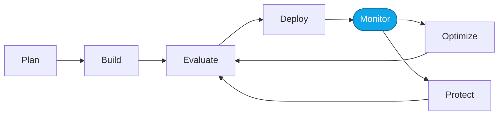

# Lab 01 — Observe traces in the Foundry portal

> **What you'll do:** Generate a handful of Prompt Agent traces and read them in the portal to build intuition for what "observability" gives you.
> **Time:** ~20 min · **Prerequisites:** [Core Lab 00](./00-overview.md)

## 🎯 Goal

See real traces of the Contoso Travel Concierge — inputs, tool calls, outputs,
latency, cost — so you can spot patterns before we score anything.

## 🧭 Where this fits

## 📋 Steps

<!-- TODO(nitya): add screenshots of Tracing tab, a single trace expanded. -->

1. **Send 5–10 varied prompts** through the Playground. Suggested mix: a
   simple flight query, a multi-city trip, an ambiguous request, a request
   for something not in the CSVs.
2. **Open Tracing** in the Foundry portal.
3. **Pick a trace** and expand every span. Note:
   - The system prompt at the top
   - Each tool call and its arguments
   - The final response
4. **Sort by latency and by cost.** Which prompts are outliers?

> 💡 **Tip:** hover a span to see its duration. Long tool calls are usually
> your best optimization targets.

## ✅ Verify

You can answer these from the portal alone:

- Which of your prompts had the **longest** total latency?
- Which had the **most tool calls**?
- Did any produce a response that referenced an id **not** in the CSVs?

## 🧠 Recap

- Traces are how you go from "the agent feels off" to a specific span you can
  poke at.
- Latency and tool-call counts are the first-order signals.
- Hallucinated ids are a common failure mode we'll target in evaluation.

## ➡️ Next

**[Lab 02 — Evaluate the Prompt Agent](./02-evaluate-portal.md)**
