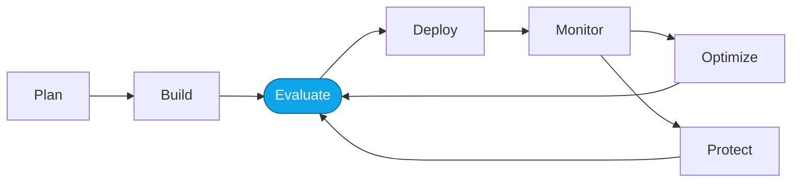

# Lab 02 — Evaluate the Prompt Agent

> **What you'll do:** Assemble a small dataset, wire up a built-in quality evaluator, and score the Prompt Agent.
> **Time:** ~25 min · **Prerequisites:** [Core Lab 01](./01-observe-portal.md)

## 🎯 Goal

Move from vibes to numbers — produce a repeatable **scorecard** for the
current Prompt Agent that we can compare against later.

## 🧭 Where this fits



## 📋 Steps

1. **Generate a sample dataset.**
   In the portal, use "Generate dataset" seeded from your traces (Lab 01) to
   produce ~10 travel queries.

   > 💡 If yours looks weak, use the shipped reference:
   > ```bash
   > ./scripts/use-reference.sh datasets sample-prompts-v1
   > ```

   <!-- TODO(nitya): screenshot of Generate dataset flow. -->
2. **Create a quality evaluator** bound to your `evaluator` model deployment.

   > 💡 Or use the reference:
   > ```bash
   > ./scripts/use-reference.sh evaluators quality-evaluator-v1
   > ```
3. **Run the evaluation** against the Prompt Agent using your dataset.
4. **Record the baseline score** — you'll compare against it in Lab 03.

## ✅ Verify

You have:

- A dataset of ≥10 rows in `artifacts/datasets/generated/`
- An evaluator run whose scorecard shows aggregate quality metrics
- A written-down baseline number (screenshot or note)

## 🧠 Recap

- A repeatable dataset + evaluator is what makes optimization real.
- Reference artifacts unblock you when generation is weak — but running the
  generation yourself is where the learning is.

## ➡️ Next

**[Lab 03 — Optimize with Copilot + Foundry skills](./03-optimize-skills.md)**
