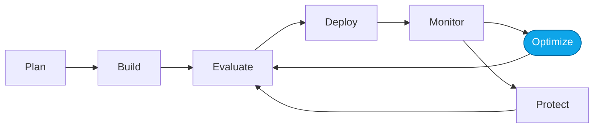

# Lab 03 — Optimize with Foundry skills + Copilot

> **What you'll do:** Use Copilot with Foundry skills to iterate on the Prompt Agent's instructions and beat the Lab 02 baseline score.
> **Time:** ~30 min · **Prerequisites:** [Core Lab 02](./02-evaluate-portal.md)

## 🎯 Goal

Run the **evaluate → optimize → evaluate** micro-loop and produce an optimized
prompt that measurably beats the baseline.

## 🧭 Where this fits



## 📋 Steps

<!-- TODO(nitya): capture Copilot chat screenshots + the skill invocation. -->

1. **Open Copilot Chat in VS Code** with this repo as the workspace.
2. **Ask Copilot to run the optimization loop** using the Foundry skills:

   > "Run the evaluate-optimize loop against the Prompt Agent using
   > `artifacts/datasets/generated/sample-prompts-v1.jsonl` and the
   > `quality-evaluator-v1` evaluator. Show me the top failure clusters
   > before proposing prompt changes."
3. **Review Copilot's proposed prompt changes** before accepting.
4. **Apply the winning prompt** back in the portal.
5. **Re-run the evaluator.**

## ✅ Verify

Your new score beats the baseline from Lab 02.

Save the winning prompt to `artifacts/prompts/generated/`; if you want the
reference version:

```bash
./scripts/use-reference.sh prompts prompt-agent-optimized-v1
```

## 🧠 Recap

- Copilot + Foundry skills automate the tedious parts of the loop.
- **You** stay in the loop — reviewing proposals before applying them.
- The reference optimized prompt exists as a fallback, not a substitute.

## ➡️ Next

**[Lab 04 — Monitor the optimized agent](./04-monitor-portal.md)**
