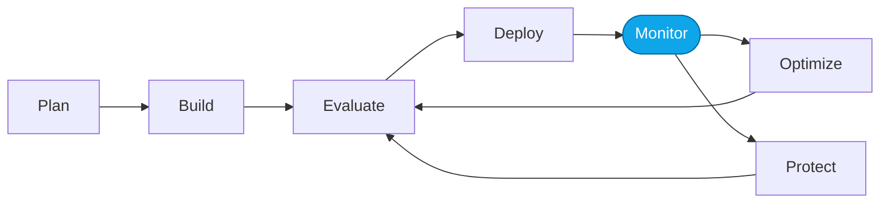

# Lab 04 — Monitor and trace outcomes

> **What you'll do:** Return to the portal to see the optimized agent's traces, monitoring dashboard, and the shape of the improvement.
> **Time:** ~15 min · **Prerequisites:** [Core Lab 03](./03-optimize-skills.md)

## 🎯 Goal

Close the loop — confirm that what the evaluator said improved actually shows
up in real traces.

## 🧭 Where this fits

## 📋 Steps

1. **Send the same 5–10 prompts** you used in Lab 01 to the optimized agent.
2. **Open Monitoring** in the Foundry portal.
3. **Compare** aggregate latency, cost, and tool-call counts before/after.
4. **Spot-check individual traces** — pick one that used to fail and confirm the new behavior.

> ⚠️ **Gotcha:** small samples are noisy. Don't over-index on a single trace.

## ✅ Verify

- Monitoring dashboard shows the new deployment.
- At least one previously-failing prompt now succeeds.
- You can name **one specific thing** the optimized prompt changed.

## 🧠 Recap

- Evaluators score; monitors observe. Both need to agree.
- If the evaluator says "better" but monitoring says "worse," trust monitoring.
- You've completed the loop once — the capstone applies it end-to-end.

## ➡️ Next

**[Lab 05 — Capstone: apply the loop to the Hosted Agent](./05-capstone-hosted.md)**
