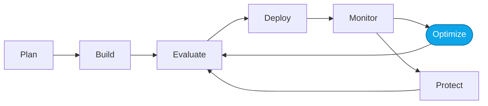

# Lab 05 — Capstone: apply the loop to the Hosted Agent

> **What you'll do:** Repeat the observe → evaluate → optimize → monitor loop against the containerized Hosted Agent in `src/`.
> **Time:** ~30 min · **Prerequisites:** [Core Lab 04](./04-monitor-portal.md)

## 🎯 Goal

Prove you can run the loop on your own — this time on code you can edit —
producing a measurable improvement.

## 🧭 Where this fits

## 📋 Steps

1. **Observe** — send prompts to the Hosted Agent; open Tracing in the portal.
2. **Evaluate** — reuse `sample-prompts-v1` and `quality-evaluator-v1`.
3. **Optimize** — edit `src/` (instructions, tools, or code). Redeploy with
   `azd deploy` (or `azd up`).
4. **Monitor** — verify the improvement in the portal.
5. **Reset when done** — `./scripts/reset.sh` restores `src/` to baseline.

> 💡 **Tip:** the coach can walk you through where to change `src/` if you get
> stuck — it will guide, not do the edits for you.

## ✅ Verify

- Your optimized Hosted Agent scores higher than baseline on the Lab 02 dataset.
- You can articulate **what** you changed and **why** it moved the metric.

## 🧠 Recap

- Same loop, different runtime.
- The Prompt Agent taught you the loop; the Hosted Agent teaches you the loop
  applies to any agent code you own.

## ➡️ Next

Explore the **[More Labs](../more/README.md)** — one question, one lab each.
