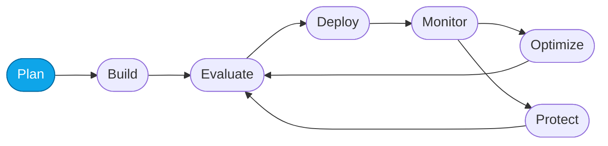

# Lab 00 — Course overview & the Agent DevOps loop

> **What you'll do:** Understand the course structure, the scenario, and the Agent DevOps loop before you start building.
> **Time:** ~10 min · **Prerequisites:** _none_

## 🎯 Goal

Get oriented — you'll leave this lab knowing **what** the Contoso Travel
Concierge is, **why** we care about the Agent DevOps loop, and **which path**
through the workshop you'll take.

## 🧭 Where this fits

> 🧭 **This lab covers:** _Plan_ — get the mental model before you touch anything.

## 📋 Steps

1. **Read the [scenario](#scenario) below.**
   You should now be able to name the four data sources the Concierge queries.
2. **Skim the [Agent DevOps loop](#agent-devops-loop) diagram.**
   You should now recognize the seven nodes and how they connect.
3. **Pick your provisioning path** for the next lab: `azd up` (self-guided) or
   Foundry portal (UI-first).

### Scenario

**Contoso Travel** is a fictitious travel agency. Their AI-powered **Contoso
Travel Concierge** orchestrates specialist sub-agents that read three CSVs:

| Data source | What it holds |
|---|---|
| `data/flights.csv`     | Flights (id, airline, route, price, cabin, seats) |
| `data/hotels.csv`      | Hotels (id, name, city, stars, price, amenities) |
| `data/car_rentals.csv` | Car rentals (id, company, city, type, price) |

<!-- TODO(nitya): add architecture diagram showing Concierge -> specialists -> CSVs -->

### Agent DevOps loop

Every Core Lab targets one node of the loop. Together they teach the complete
cycle you'll run whenever the agent underperforms.

| Node | What happens here |
|------|-------------------|
| **Plan** | Define the scenario, success criteria, and target cost/latency/quality metrics. |
| **Build** | Create the agent — model, instructions, and tools. |
| **Evaluate** | Assess quality, performance, and safety with built-in and custom metrics. |
| **Deploy** | Publish the agent to an endpoint you can call from a UI or code. |
| **Monitor** | Trace runs and watch production behavior at scale with Application Insights. |
| **Optimize** | Tune instructions, model, or tools to close gaps against the targets, then re-evaluate. |
| **Protect** | Guard against unsafe or adversarial inputs (red-teaming, guardrails) before re-evaluating. |

## ✅ Verify

Answer these to yourself (no tool required):

- Which three CSVs does the Concierge use?
- What are the seven nodes of the Agent DevOps loop?
- Which path (`azd up` or portal) will you take in Lab 01?

If you can answer all three, you're ready to provision.

## 🧠 Recap

- The **Contoso Travel Concierge** is a fictitious multi-agent travel assistant.
- The **Agent DevOps loop** is the cycle we improve the agent inside.
- The course has **two provisioning paths** and gets you to the same starting line.

## ➡️ Next

Choose one:

- Self-guided → **[Lab 01 — Provision with `azd up`](./01-provision-azd.md)**
- UI-first → **[Lab 02 — Provision with the portal](./02-provision-portal.md)**
