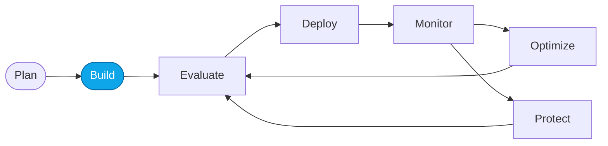

# Lab 01 — Provision Foundry with `azd up`

> **What you'll do:** Provision a Microsoft Foundry project and supporting resources with a single `azd up` command.
> **Time:** ~15 min · **Prerequisites:** [Lab 00](./00-overview.md)

## 🎯 Goal

Stand up your Foundry project, Application Insights, and Container Registry
using the Azure Developer CLI so later labs have somewhere to deploy to.

## 🧭 Where this fits



> 🧭 **This lab covers:** _Build_ — provisioning the substrate.

## 📋 Steps

1. **Log in to Azure.**
   ```bash
   az login
   azd auth login
   ```
   You should now see your subscription printed.
2. **Initialize the environment.**
   ```bash
   azd env new contoso-travel
   ```
3. **Provision resources.**
   ```bash
   azd up
   ```
   <!-- TODO(nitya): confirm the exact resources our infra/main.bicep provisions
        and list them here with their tags. -->
4. **Note the outputs.**
   Copy the Foundry project endpoint and Application Insights connection string
   into your notes — later labs reference them.

> ⚠️ **Gotcha:** the first `azd up` on a fresh subscription can take 10+ minutes.
> Keep the terminal open.

## ✅ Verify

Run:

```bash
azd env get-values | grep FOUNDRY_PROJECT_ENDPOINT
```

Expected: a single line printing the endpoint URL. If present, provisioning succeeded.

<!-- TODO(nitya): add a screenshot of a successful `azd up` completion. -->

## 🧠 Recap

- `azd up` provisioned Foundry + Application Insights + ACR in one command.
- Environment values are stored per-`azd env` and reused by later labs.
- You now have a project endpoint to point agents at.

## ➡️ Next

**[Lab 03 — Deploy required models](./03-deploy-models.md)**

<!-- TODO(nitya): if learners took the portal path (Lab 02), route them
     directly to Lab 03 as well. -->
