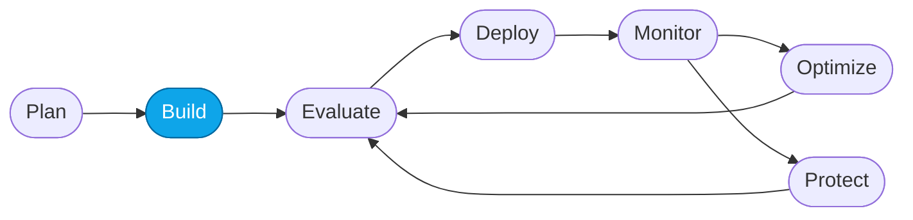

# Lab 01 — Provision Foundry with `azd up`

> **What you'll do:** Stand up a Foundry project, model, container registry, and Application Insights in your Azure subscription with a single command.
> **Time:** ~15 min · **Prerequisites:** [Lab 00](./00-overview.md)
>
> ⏩ **Taking the portal path instead?** Skip to [Lab 02](./02-provision-portal.md).

## 🎯 Goal

Provision the Foundry substrate the rest of the workshop uses — one command,
one resource group, tearable-down in one command at the end.

## 🧭 Where this fits



> 🧭 **This lab covers:** _Build_ — provisioning the substrate you'll deploy the
> Concierge onto.

## Before you start

Confirm you have:

1. An **Azure subscription** where you can create resources.
2. **`gpt-5.4-mini`** Global Standard quota in one of these regions:
   - **`eastus2`** ⭐ (default)
   - **`swedencentral`** (EU alternate)
   - **`northcentralus`** (US backup)
3. Either the workshop **devcontainer** open (see `.devcontainer/README.md`)
   or `az`, `azd`, and Python 3.11+ installed locally.

> ⚠️ **Cost:** provisioning runs in **your** subscription and incurs cost.
> You'll tear it all down with `azd down` at the end.

## 📋 Steps

1. **Sign in to Azure with `az`.**
   ```bash
   az login --use-device-code
   ```
   Complete the device-code flow in the browser, then pick the subscription
   you want to deploy into.

2. **Sign in with `azd`.**
   ```bash
   azd auth login --use-device-code
   ```
   Complete the same device-code flow.

   <!-- TODO(nitya): screenshot of the device-code prompt in the terminal -->

3. **Create an `azd` environment.**
   ```bash
   azd env new contoso-travel
   ```
   This tags all resources under a single prefix so cleanup later is one
   `azd down` away.

4. **Deploy.**
   ```bash
   azd up
   ```
   When prompted, choose region **`eastus2`** (or one of the alternates above).

   `azd up` provisions the Bicep in [`../../infra/`](../../infra/):
   - resource group
   - Foundry account + project
   - `gpt-5.4-mini` model deployment
   - Container Registry (for the hosted agent image)
   - Log Analytics + Application Insights
   - Storage account
   - AI Search + Bing grounding connections

   Then it builds and pushes the hosted-agent container and publishes it as
   **`contoso-concierge`**. First run: **5–10 minutes**.

   <!-- TODO(nitya): screenshot of a successful `azd up` output with the endpoint + playground link -->

5. **Read the outputs.**
   The tail of `azd up` prints:
   - the **Foundry project endpoint**,
   - the **agent name** (`contoso-concierge`),
   - a **direct link to the playground**.

   Copy these into your notes — you'll use them in every later lab.

> 💡 **Tip:** `azd env get-values` prints everything `azd` knows about your
> environment. Later labs use this to pick up endpoints automatically.
>
> ⚠️ **Gotcha:** if `azd up` fails on quota, retry in a different region from
> the list above using `azd env set AZURE_LOCATION swedencentral` then
> `azd provision` again.

## ✅ Verify

Run:

```bash
azd env get-values | grep -E "AZURE_AI_PROJECT_ENDPOINT|AZURE_AI_MODEL_DEPLOYMENT_NAME"
```

Expected: two lines — the project endpoint URL and `gpt-5.4-mini`. If both
print, provisioning succeeded.

Then open <https://portal.azure.com>, go to **Resource groups**, and confirm the
`rg-contoso-travel-*` group contains a Foundry account, a container registry,
Application Insights, Log Analytics, and a storage account.

<!-- TODO(nitya): screenshot of the resource group in the Azure portal -->

## 🧠 Recap

- `azd up` provisioned Foundry + models + observability + hosting in one shot.
- Environment values are stored per-`azd env` and reused by later labs.
- You now have a **live hosted agent** ready to open in Lab 06.

## ➡️ Next

**[Lab 03 — Deploy required models](./03-deploy-models.md)** to confirm the
model deployment came up, or jump ahead to
**[Lab 05 — Deploy the hosted agent](./05-deploy-hosted-agent.md)** if you
want to redeploy the container.

If you're planning to use the **Prompt Agent** (Core Labs 01–04), continue with
**[Lab 04 — Create the Prompt Agent](./04-create-prompt-agent.md)**.
