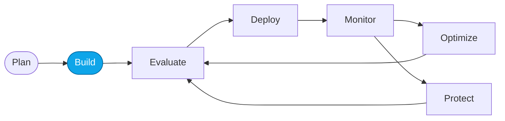

# Lab 02 — Provision Foundry with the portal

> **What you'll do:** Create your Foundry project and Application Insights through the Foundry portal UI.
> **Time:** ~15 min · **Prerequisites:** [Lab 00](./00-overview.md)

## 🎯 Goal

Reach the same starting line as Lab 01, but through the portal — useful if you
prefer clicking to CLI or if `azd` isn't available in your environment.

## 🧭 Where this fits

> 🧭 **This lab covers:** _Build_ — same node as Lab 01, alternate path.

## 📋 Steps

<!-- TODO(nitya): capture portal screenshots for each step. Cropped, dark-mode. -->

1. **Open the Foundry portal.**
   Navigate to `https://ai.azure.com` and sign in.
2. **Create a new project.**
   Name it `contoso-travel`. Select a supported region.
   You should now see the project overview page.
3. **Link Application Insights.**
   From the project settings, create or link an Application Insights instance.
4. **Note your endpoints.**
   Record the project endpoint URL — later labs will need it.

> 💡 **Tip:** you can re-run Lab 01 later to hydrate an `azd` env from this project.

## ✅ Verify

Open the project overview page and confirm:

- Status: **Ready**
- Application Insights: **Linked**

If both are true, you're provisioned.

## 🧠 Recap

- You provisioned the same Foundry substrate as Lab 01, via the portal.
- The portal path is the fallback when `azd` isn't available.
- Endpoints and connection strings are captured for later labs.

## ➡️ Next

**[Lab 03 — Deploy required models](./03-deploy-models.md)**
