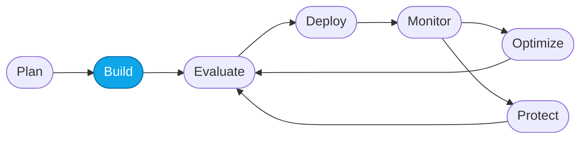

# Lab 03 — Deploy the required models

> **What you'll do:** Deploy `gpt-5.4-mini` (and optionally a judge model) into your Foundry project.
> **Time:** ~10 min · **Prerequisites:** [Lab 01](./01-provision-azd.md) **or** [Lab 02](./02-provision-portal.md)

## 🎯 Goal

Deploy the language model(s) your agents and evaluators will call. This is the
one step where the CLI path and the portal path do the same thing — because
`azd up` already deployed the primary model for you.

## 🧭 Where this fits



> 🧭 **This lab covers:** _Build_ — putting a model behind an endpoint.

## Models this workshop uses

| Deployment name | Purpose | Default region |
|---|---|---|
| `gpt-5.4-mini` | Concierge + specialist reasoning | `eastus2` |
| `gpt-5.4` (optional) | Judge model for AI-assisted evaluators in Core Lab 02 | `eastus2` |

> 💡 The judge model is optional. If your quota is tight, reuse `gpt-5.4-mini`
> as the judge and skip the second deployment.

## 📋 Steps

**If you provisioned with `azd up` (Lab 01):**

1. Confirm the deployment already exists:
   ```bash
   azd env get-values | grep AZURE_AI_MODEL_DEPLOYMENT_NAME
   ```
   You should see `AZURE_AI_MODEL_DEPLOYMENT_NAME="gpt-5.4-mini"`.
   ✅ You're done — skip to **Verify**.

**If you provisioned with the portal (Lab 02):**

1. Open the Foundry portal and select your project.
2. In the sidebar, click **My assets → Models + endpoints**.
3. Click **+ Deploy model → Deploy base model**.

   <!-- TODO(nitya): screenshot of the "Deploy model" button -->

4. Search for **`gpt-5.4-mini`** and select it.
5. Set:
   - **Deployment name:** `gpt-5.4-mini` (match the value your labs reference)
   - **Deployment type:** **Global Standard**
   - **Tokens per Minute (TPM):** the maximum your quota allows (≥ 100k recommended)
6. Click **Deploy** and wait ~1 minute for the deployment to reach *Succeeded*.

   <!-- TODO(nitya): screenshot of the deployment reaching Succeeded -->

**Optional — judge model:**

7. Repeat steps 3–6 with **`gpt-5.4`** and deployment name `gpt-5.4-judge`.
   You'll reference this in Core Lab 02.

> ⚠️ **Gotcha:** if the deploy button is greyed out, you're out of quota.
> Try a different region from the supported list, or request a quota increase
> from **Management center → Quota**.

## ✅ Verify

In the Foundry portal, open **My assets → Models + endpoints**. You should see:

- `gpt-5.4-mini` — state **Succeeded**
- (optional) `gpt-5.4-judge` — state **Succeeded**

Then, if you have `azd`:

```bash
azd env get-values | grep AZURE_AI_MODEL
```

<!-- TODO(nitya): screenshot of the Models list with both deployments -->

## 🧠 Recap

- Models are **deployments** inside a Foundry project — a name, a base model,
  and a TPM budget.
- Deployment names are the identifiers your agents and evaluators reference.
- The `azd` path deploys the model for you via Bicep;
  the portal path is a two-minute UI flow.

## ➡️ Next

**[Lab 04 — Create the Prompt Agent](./04-create-prompt-agent.md)**
