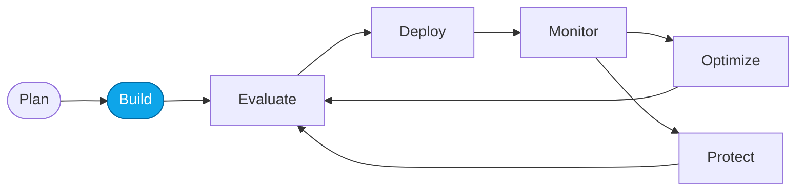

# Lab 03 — Deploy required models

> **What you'll do:** Deploy the chat and evaluator models the Concierge and later evaluators will use.
> **Time:** ~10 min · **Prerequisites:** [Lab 01](./01-provision-azd.md) or [Lab 02](./02-provision-portal.md)

## 🎯 Goal

Deploy the models the workshop depends on so both agents have something to
call and the evaluators have a judge model.

## 🧭 Where this fits

## 📋 Steps

<!-- TODO(nitya): confirm exact model names and versions the workshop pins.
     Candidates: gpt-4o-mini (agent), gpt-4o (evaluator), text-embedding-3-small. -->

1. **Open your Foundry project's Models + endpoints page.**
2. **Deploy the agent chat model.**
   Recommended: `gpt-4o-mini`. Name the deployment `chat`.
3. **Deploy the evaluator model.**
   Recommended: `gpt-4o`. Name the deployment `evaluator`.
4. **(Optional) Deploy an embedding model.**
   Recommended: `text-embedding-3-small`. Name it `embed`.
   Only needed for More Lab: trace-driven datasets.

> ⚠️ **Gotcha:** deployment names are referenced by later labs — stick with
> `chat`, `evaluator`, `embed` unless you plan to update every callsite.

## ✅ Verify

Open **Models + endpoints** and confirm you see:

| Deployment | Model | Status |
|---|---|---|
| `chat` | gpt-4o-mini | Succeeded |
| `evaluator` | gpt-4o | Succeeded |

If both show Succeeded, you're done.

## 🧠 Recap

- Deployment names are your API — pick them once, reuse everywhere.
- You have separate agent and evaluator deployments so the judge doesn't grade
  its own output.

## ➡️ Next

**[Lab 04 — Create the Prompt Agent](./04-create-prompt-agent.md)**
