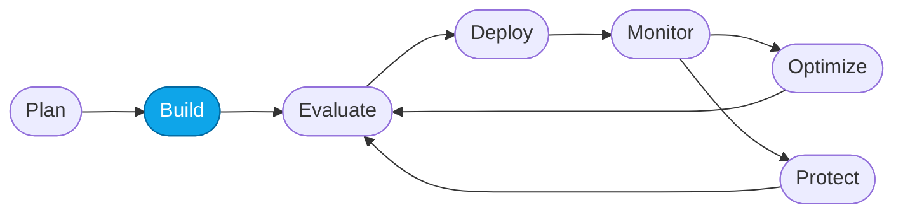

# Lab 04 — Create the Prompt Agent

> **What you'll do:** Create the "Contoso Travel Concierge" **Prompt Agent** in the Foundry portal, seeded with the baseline system prompt and the three Contoso datasets.
> **Time:** ~15 min · **Prerequisites:** [Lab 03](./03-deploy-models.md)

## 🎯 Goal

Get a working, portal-authored **Prompt Agent** you can chat with — this is
what Core Labs 01–04 observe, evaluate, optimize, and monitor.

## 🧭 Where this fits

> 🧭 **This lab covers:** _Build_ — creating the prompt-agent flavor of the Concierge.

## What's a "prompt agent"?

A **Prompt Agent** in Foundry is a lightweight, portal-authored agent: it has
instructions (a system prompt), attached tools/knowledge (files, functions,
grounding), and a model — but no container. It's the fastest path to a working
agent and the natural starting point for observability.

Contrast with the **Hosted Agent** you already deployed via `azd up`
(`contoso-concierge`), which is a containerized multi-agent orchestrator you
control in code — deeper power, more moving parts.

The workshop uses **both** so you can compare their observability, evaluation,
and optimization surfaces.

## 📋 Steps

1. **Open the Foundry portal and select your project.**

2. **Create a new agent.**
   Sidebar → **My assets → Agents** → **+ New agent** → **Prompt agent**.
   Name it **`contoso-travel-concierge-prompt`**.

   <!-- TODO(nitya): screenshot of the "New agent" flow -->

3. **Pick the model.**
   Under **Model**, choose the deployment you created in Lab 03
   (`gpt-5.4-mini`). Leave temperature at the default for now.

4. **Paste the baseline instructions.**
   Under **Instructions**, paste the contents of
   [`../../artifacts/prompts/reference/prompt-agent-baseline-v1.md`](../../artifacts/prompts/reference/prompt-agent-baseline-v1.md).

   > 💡 This is intentionally the *underperforming baseline* — it works for
   > simple questions but fails on the eval set. That gap is what Core Lab 03
   > closes.

5. **Attach the Contoso datasets as knowledge (files).**
   Under **Knowledge → Files**, upload:
   - `data/flights.csv`
   - `data/hotels.csv`
   - `data/car_rentals.csv`

   <!-- TODO(nitya): screenshot of the three files attached under Knowledge -->

6. **Save the agent.**
   Click **Save** or **Deploy**. Wait for the agent to reach *Ready*.

7. **Smoke-test in the playground.**
   Click **Try in playground** and ask:

   > *"What business-class flights are available from Chicago to Rome under $2500?"*

   You should get a grounded answer citing entries from `flights.csv`. Now try:

   > *"Plan a weekend in Tokyo."*

   Notice how the baseline agent asks a lot of clarifying questions instead of
   proposing an itinerary — that's exactly the failure mode Core Lab 03 will fix.

> ⚠️ **Gotcha:** if the agent's answers don't reference the CSV data, your
> files probably didn't finish indexing. Wait a minute and re-ask, or reattach.

## ✅ Verify

- The Foundry portal shows `contoso-travel-concierge-prompt` under
  **My assets → Agents** with status **Ready**.
- The playground returns grounded answers that reference specific flight IDs
  (e.g., `CT-FL-...`).

## 🧠 Recap

- A Prompt Agent = instructions + tools/knowledge + model — all portal-authored.
- You seeded the intentionally-weak **baseline v1** prompt so Core Lab 03 has
  something to improve.
- You now have **two agents** deployed: the Prompt Agent and the Hosted Agent.

## ➡️ Next

**[Lab 05 — Deploy (or redeploy) the Hosted Agent](./05-deploy-hosted-agent.md)**
