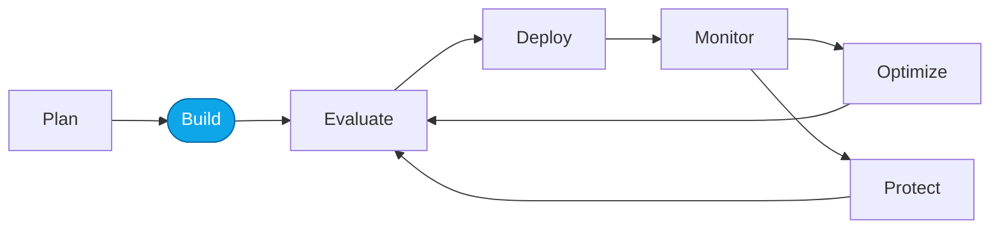

# Lab 04 — Create the Prompt Agent (no-code)

> **What you'll do:** Author a baseline Prompt Agent in the Foundry portal that answers travel questions using the shared CSV data.
> **Time:** ~15 min · **Prerequisites:** [Lab 03](./03-deploy-models.md)

## 🎯 Goal

Stand up a no-code **Prompt Agent** — the baseline you'll observe, evaluate,
and optimize throughout Core Labs.

## 🧭 Where this fits

## 📋 Steps

1. **Open Agents → Create → Prompt Agent** in the Foundry portal.
2. **Name it `contoso-travel-concierge`.** Bind it to your `chat` model deployment.
3. **Author instructions.**
   Start with a minimal baseline — for example:

   > You are the Contoso Travel Concierge. Help travelers plan trips using
   > flights, hotels, and car rentals from Contoso's inventory. Ask
   > clarifying questions when needed.

   <!-- TODO(nitya): drop in the reference prompt from
        artifacts/prompts/reference/prompt-agent-baseline-v1.md once authored,
        or point learners at `./scripts/use-reference.sh prompts prompt-agent-baseline-v1`. -->
4. **Attach the shared data.**
   Upload `data/flights.csv`, `data/hotels.csv`, `data/car_rentals.csv` as
   knowledge files, or wire them via a tool.
5. **Save and open the Playground.**

## ✅ Verify

In the Playground, send:

> "Find me a Business-class flight from Seattle to Paris in August."

You should get back a response that references a `CT-FL-*` flight id.

## 🧠 Recap

- The Prompt Agent is a **no-code baseline** — instructions + data, no runtime.
- We'll observe → evaluate → optimize this same agent in Core Labs.
- If your agent hallucinates a flight not in the CSV, that's exactly the kind
  of failure the DevOps loop will catch and fix.

## ➡️ Next

**[Lab 05 — Deploy the Hosted Agent](./05-deploy-hosted-agent.md)**
