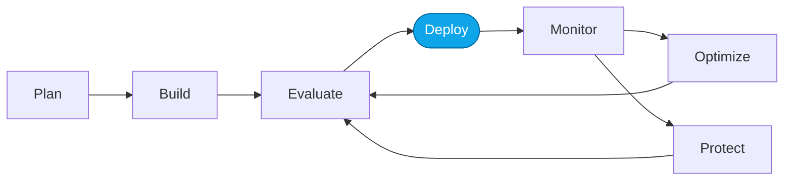

# Lab 05 — Deploy the Hosted Agent

> **What you'll do:** Build and deploy the containerized Contoso Travel Concierge from `src/` using `azd up`.
> **Time:** ~15 min · **Prerequisites:** [Lab 03](./03-deploy-models.md)

## 🎯 Goal

Get the **Hosted Agent** running on Foundry-managed infrastructure so you have
a code-first target for the Core Labs capstone and More Labs.

## 🧭 Where this fits



## 📋 Steps

<!-- TODO(nitya): confirm exact commands once src/ and infra/ are ported. -->

1. **Inspect the code.**
   ```bash
   ls src/
   ```
   You should see `main.py`, `agent.yaml`, `Dockerfile`, `requirements.txt`.
2. **Deploy.**
   ```bash
   cd src && azd up
   ```
   The build → push → deploy takes ~5 minutes.
3. **Note the endpoint URL** printed at the end.

> 💡 **Tip:** if you break `src/` while experimenting later, run
> `./scripts/reset.sh` to restore from `src.original/`.

## ✅ Verify

```bash
curl -H "Authorization: Bearer $(az account get-access-token --query accessToken -o tsv)" \
     "$FOUNDRY_HOSTED_AGENT_ENDPOINT/health"
```

Expected: `{"status":"ok"}` (or equivalent).

## 🧠 Recap

- The Hosted Agent is your containerized code deployed on Foundry.
- `src.original/` is the pristine baseline; `scripts/reset.sh` restores it.
- Same scenario, same data as the Prompt Agent — different runtime.

## ➡️ Next

**[Lab 06 — Smoke-test both agents](./06-verify.md)**
