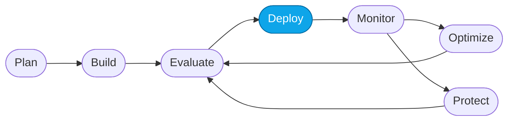

# Lab 05 — Deploy (or redeploy) the Hosted Agent

> **What you'll do:** Confirm the containerized **Contoso Travel Concierge** hosted agent is live, or redeploy it after a code change.
> **Time:** ~10 min · **Prerequisites:** [Lab 03](./03-deploy-models.md)

## 🎯 Goal

Get the hosted agent (multi-agent orchestrator in `src/`) live in Foundry so
Core Lab 05 (the capstone) has something to observe, evaluate, and optimize.

## 🧭 Where this fits



> 🧭 **This lab covers:** _Deploy_ — publishing a containerized agent to Foundry.

## Two ways to be here

- 🟢 **You ran `azd up`** in Lab 01 → the hosted agent is **already deployed**.
  This lab is a **verification pass** + a quick tour of what got deployed.
- 🟠 **You took the portal path** in Lab 02 → you have a project but no hosted
  agent yet. Follow the portal upload flow below.

## 📋 Steps — verifying the `azd up` deployment

1. **Check that `azd` sees the hosted agent.**
   ```bash
   azd ai agent show contoso-concierge
   ```
   You should see the agent name, endpoint, status **Ready**, and the model
   deployment it uses.

2. **Look at what was deployed.**
   ```bash
   ls src/
   ```
   Everything in `src/` is what shipped inside the container:
   - `main.py` — Agent Framework orchestrator + specialist tools
   - `agent.yaml` — hosted-agent descriptor (protocol, resources, env vars)
   - `instructions/concierge.md` — the **active** concierge system prompt
     (loaded at container startup)
   - `instructions/versions/instructions-0.md` — the immutable baseline seed
   - `data/*.csv` — the Contoso datasets bundled into the image

3. **Invoke it once.**
   ```bash
   azd ai agent invoke contoso-concierge \
     '{"input": "What business-class flights leave Chicago for Rome?"}'
   ```
   You should get a JSON response with a grounded answer.

   <!-- TODO(nitya): screenshot of a successful `azd ai agent invoke` output -->

4. **Open it in the playground.**
   In the Foundry portal → **My assets → Agents → contoso-concierge → Try in
   playground**. Ask the same question. Same answer, richer trace.

## 📋 Steps — deploying via the portal (portal path only)

1. **Open the portal → My assets → Agents → + New agent → Hosted agent**.
2. Provide:
   - **Agent name:** `contoso-concierge`
   - **Container image:** upload or point to a registry image built from `src/`
   - **Model deployment:** `gpt-5.4-mini` (from Lab 03)
3. Click **Deploy** and wait for status **Ready**.

<!-- TODO(nitya): screenshot of the portal hosted-agent deploy flow -->

> ⚠️ **Gotcha (portal path):** the container image must expose the Responses
> protocol on port 8088 — the shipped `Dockerfile` already does this. Build
> from `src/` unmodified for your first deploy.

## Redeploying after a code change

Any time you edit `src/main.py` or `src/instructions/concierge.md`:

```bash
azd deploy contoso-concierge --no-prompt
```

To go back to the pristine baseline first:

```bash
./scripts/reset.sh
```

## ✅ Verify

- `azd ai agent show contoso-concierge` prints status **Ready** with an endpoint URL.
- The Foundry portal shows the agent under **My assets → Agents** with type **Hosted**.
- A single `invoke` (curl or `azd ai agent invoke`) returns a grounded JSON response.

## 🧠 Recap

- The hosted agent is a **container** whose image was built from `src/` and
  published to Foundry.
- The concierge system prompt lives in a file (`src/instructions/concierge.md`)
  so it can evolve independently of code.
- `azd deploy` is your redeploy loop; `./scripts/reset.sh` is your undo.

## ➡️ Next

**[Lab 06 — End-to-end verification](./06-verify.md)**
