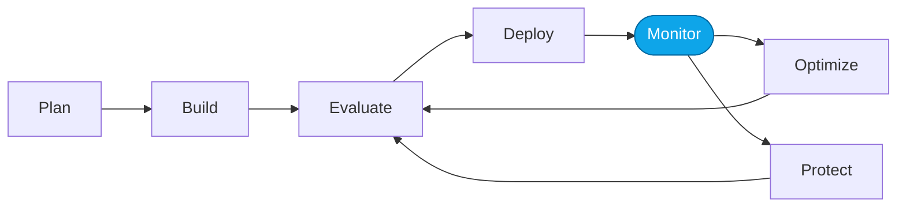

# Lab 06 — Smoke-test both agents

> **What you'll do:** Send the same prompt to the Prompt Agent and the Hosted Agent and confirm both respond.
> **Time:** ~10 min · **Prerequisites:** [Lab 04](./04-create-prompt-agent.md) and [Lab 05](./05-deploy-hosted-agent.md)

## 🎯 Goal

Verify Fundamentals are complete — both agents respond to a canonical prompt
against the shared dataset.

## 🧭 Where this fits



## 📋 Steps

1. **Prompt Agent** — in the Foundry portal Playground, send:

   > "What's a cheap car rental in Paris around Aug 15?"

   You should see a response naming a `CT-CR-*` rental id.
2. **Hosted Agent** — send the same prompt via the Responses API:

   ```bash
   curl -X POST "$FOUNDRY_HOSTED_AGENT_ENDPOINT/responses" \
        -H "Authorization: Bearer $TOKEN" \
        -H "Content-Type: application/json" \
        -d '{"input":"Whats a cheap car rental in Paris around Aug 15?"}'
   ```

   <!-- TODO(nitya): confirm exact Responses API shape once src/ is ported. -->

## ✅ Verify

Both responses reference a `CT-CR-*` id and a price. If yes, Fundamentals is complete.

## 🧠 Recap

- Two agents, same scenario, same data.
- You're now ready to run the Agent DevOps loop against them.

## ➡️ Next

**[Core Labs — Overview](../core/00-overview.md)**
