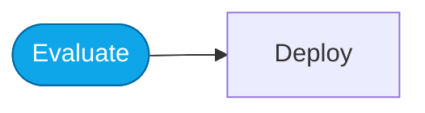

# Lab — Continuous evaluation

> **What you'll do:** Wire evaluation into your workflow so regressions are caught before merge.
> **Time:** ~25 min · **Prerequisites:** [Core Lab 04](../core/04-monitor-portal.md)

## 🎯 Goal

Move from "evaluate once" to "evaluate on every change." Learn what to gate,
what to observe, and what to ignore.

## 🧭 Where this fits

## 📋 Steps

<!-- TODO(nitya): concrete steps once continuous-eval + trace-evaluation
     workflows are validated in Foundry. -->

1. Pick the metrics you'll gate on vs. observe.
2. Configure trace-evaluation on the Hosted Agent endpoint.
3. Trigger a small change; watch the eval kick off.
4. Review the delta; decide ship/hold.

## ✅ Verify

You have a documented ship/hold rule tied to at least one metric.

## 🧠 Recap

- Gate on a small, stable metric. Observe everything else.
- Continuous eval is worthless without a delta view.

## ➡️ Next

**[Back to More Labs](./README.md)**
