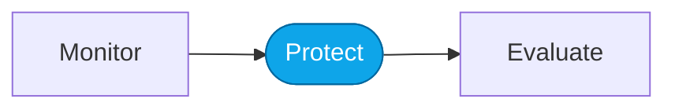

# Lab — Red-team your agent

> **What you'll do:** Run an adaptive red-teaming scan against the Hosted Agent and triage what it finds.
> **Time:** ~30 min · **Prerequisites:** [Core Lab 04](../core/04-monitor-portal.md)

## 🎯 Goal

See how the Foundry AI Red Teaming agent probes your agent for risk categories
and what a real triage flow looks like.

## 🧭 Where this fits

## 📋 Steps

<!-- TODO(nitya): concrete steps once we validate Red Teaming portal flow. -->

1. Configure a Red Teaming scan against the Hosted Agent endpoint.
2. Pick 1–2 risk categories and 1–2 attack strategies.
3. Run the scan (this takes a while).
4. Open the report and triage findings: real / not-real / needs-mitigation.

## ✅ Verify

You've categorized every finding and picked at least one to fix.

## 🧠 Recap

- Red-teaming is a mitigation-planning tool, not a gate.
- False positives are common; triage discipline matters.

## ➡️ Next

**[Back to More Labs](./README.md)**
