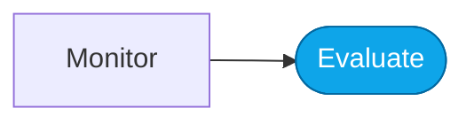

# Lab — Datasets from real traces

> **What you'll do:** Curate a fresh evaluation dataset from real production traces.
> **Time:** ~20 min · **Prerequisites:** [Core Lab 04](../core/04-monitor-portal.md)

## 🎯 Goal

Learn how to keep your eval dataset in step with real usage so the score
means something.

## 🧭 Where this fits

## 📋 Steps

<!-- TODO(nitya): concrete steps for trace-derived dataset generation. -->

1. Filter traces to the ones that matter (errors, latency outliers, new intents).
2. Sample representatively — not just the failures.
3. Label ground truth (yourself or an LLM judge with review).
4. Ship as a new dataset version alongside the existing one.

## ✅ Verify

You have a new dataset in `artifacts/datasets/generated/` derived from at
least 5 real traces.

## 🧠 Recap

- Static eval sets rot. Real traces are the antidote.
- Version datasets like code — never overwrite silently.

## ➡️ Next

**[Back to More Labs](./README.md)**
